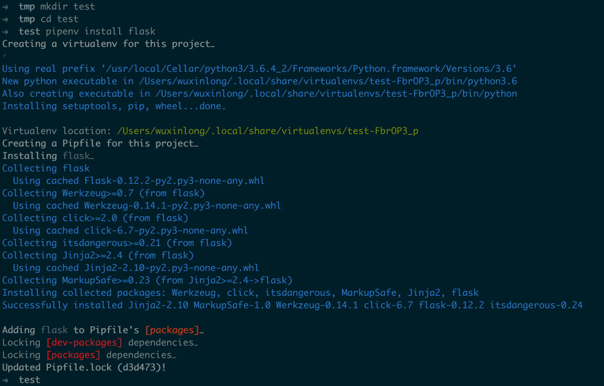
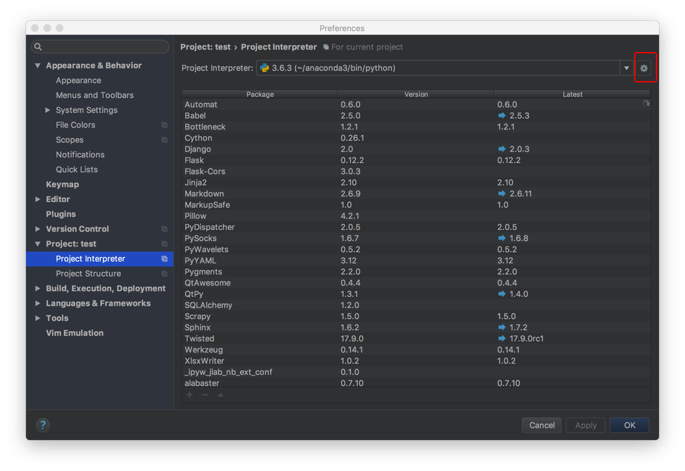
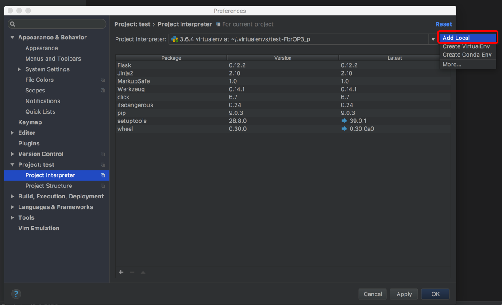
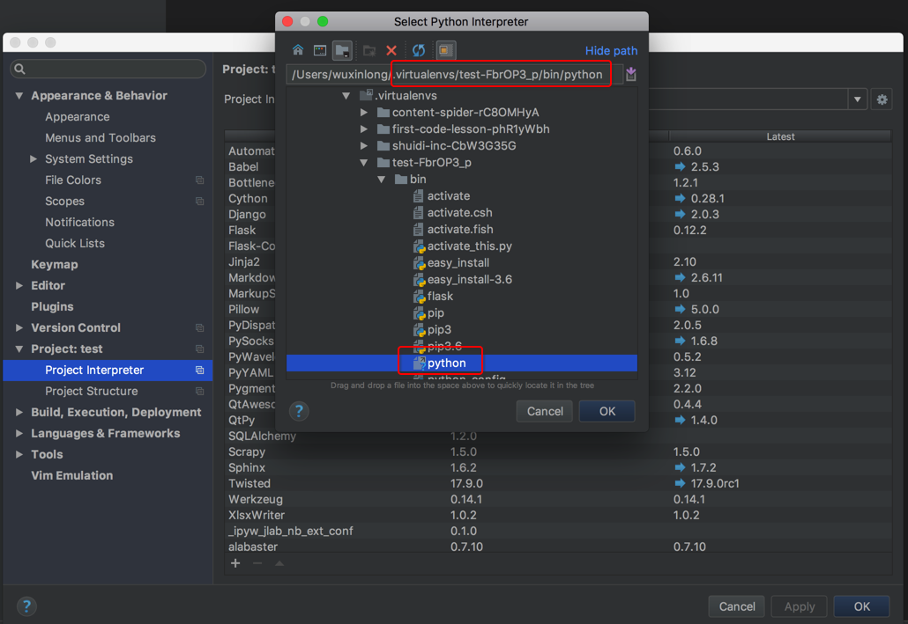
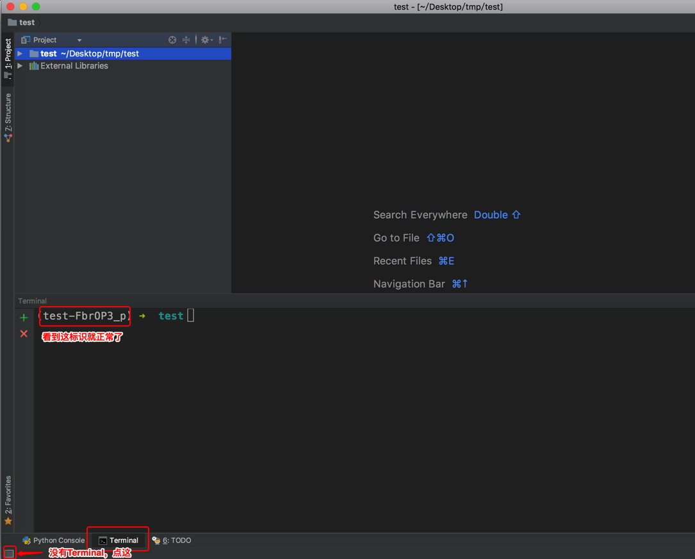

## 0. 最简单的办法
安装环境最简单的方式就是通过[anaconda](https://www.anaconda.com/distribution/#download-section)来管理。可以跳过下面步骤1到3.


## 1. 安装python3（必需）
1. 去[官网](https://www.python.org/)下载最新版本，并安装好
2. 在终端查看python版本号: `python --version`，如果报错或显示当前版本号不是你下载下来的，请google环境变量的设置，将python3所在的bin目录添加到环境变量`path`中。

## 2. 安装pipenv
[pipenv](https://docs.pipenv.org/)是官方推荐的python环境管理工具，使用起来非常方便。
```bash
pip install pipenv
```

## 3. 使用pipenv管理环境
```
# 新建一个目录
mkdir test
cd test
# 使用pipenv安装一个package（随便安装一个你待会需要的包就好了），它就会自动完成环境的初始化，并安装好该package
#
pipenv install flask
```

### 3.1 安装包
有了这种方式后，在该环境中，请忘了`pip install`安装程序的方法，而用`pipenv install`。因为它会自动将安装的包添加到`Pipfile`。
```
pipenv install package_name
```

### 3.2 移除包
```
pipenv uninstall package_name
```

### 3.3 进入环境特定命令行
```
pipenv shell
```


### 3.4 使用国内镜像（可选）
修改`Pipfile`头部设置如下：

```
[[source]]
url = "https://pypi.tuna.tsinghua.edu.cn/simple"
verify_ssl = true
name = "pypi"
```


## 4. 安装pycharm并设置
4.1 去[pycharm官网](https://www.jetbrains.com/pycharm/)下载免费版本，并安装

4.2 首先通过菜单进入设置页（快捷键: command + ,），选择`Project > Project Interpreter`，点击下拉框右边的按钮，点击`Add Local`



4.3 在你家目录下找到上面环境所在的目录，选择里面的python文件（mac上该目录为: `/Users/wuxinlong/.virtualenvs/test-FbrOP3_p`: .virtualenvs是环境根目录，test是我们的环境名称，`-FbrOP3_p`是一个随机串，起唯一标识的作用）。点击`Apply`或`Ok`即可。


4.4 选择`Terminal`窗口，该窗口会自动激活环境，此后安装的程序，就可以在该窗口中操作
```
pipenv install xxx
```



## 5. [Jupyter](https://jupyter.org/)的安装与使用
```bash
$ pipenv install jupyterlab
$ pipenv shell
(klook_python_phase_01) bogon% jupyter notebook
```


## 在线编程
* [repl](https://repl.it/languages/python3): 在线Python编程。
* [cocalc.com](https://cocalc.com/projects?session=default)：在线Jupyter。


## 价值1亿的AI程序
```python
while True:
    print(input('').replace('吗', '').replace('？', '！').replace('?', '!'))
```
大家可以复制或输入上面这段代码，自己玩一下。

