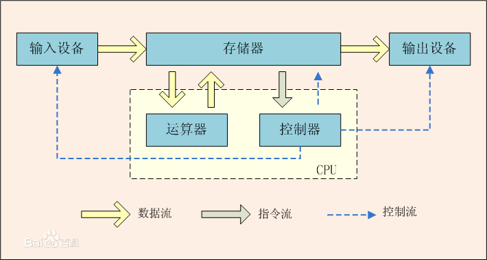

## 课间小比赛

### 1. 数学计算
设函数`y = f(x) = x!, x为正整数`，给定x，求对应的`f(x)`。计算正确、步骤清晰且时间最短者获胜。

x（变量、输入） | y（因变量，输出）
-------------|----------
1 | 1
2 | 2
3 | 6
9 | ?

```
# 求解f(5)的过程描述（在黑板上计算一下）
y = 1
y = y * 2
y = y * 3
y = y * 4
y = y * 5
返回结果y
```


## 用程序来解决问题
```python
def factorial(x):
    y = 1
    i = 2
    while y <= x:
        y = y * i
        i = i + 1
    return y
```

## 函数与变量，从数学到程序
场景 | 函数 | 变量
----|-----|----
数学 | 用来表示一个非空集合（A）到另一个非空集合（B）的映射。 | 用来表示A中的一个值。
程序 | 用来表示一个处理过程。可以在函数中做任何事情，而不只是数学计算。 | 用来表示处理过程中需要用到的东西，可以表示任何事物。


## 为什么要有函数？
1. 职责拆分，代码结构更清晰。
2. 复用。


## 冯.诺依曼体系结构——对计算机系统的抽象



### 输入与输出举例说明
场景 | 输入 | 输出
----|------|----
数学计算 | 自变量 | 函数值
计算机系统 | 交给计算机处理的任何事物 | 处理之后的结果
点外卖 | 下单 | 送上门的食物
打印 | 待打印的文件 | 打印好的纸质文件
语音输入 | 语音 | 文字


## 布尔值与逻辑运算
* 布尔值：真与假。

### 逻辑运算
逻辑运算符 | 规则 | 口诀
---------|-----|----
and | 且：两边都为真，表达式结果才为真，否则为假 | 一假必假
or | 或：两边只要有一边为真，表达式结果就为真，否则为假 | 一真必真
not | 非：将原表达式结果取反 | 


